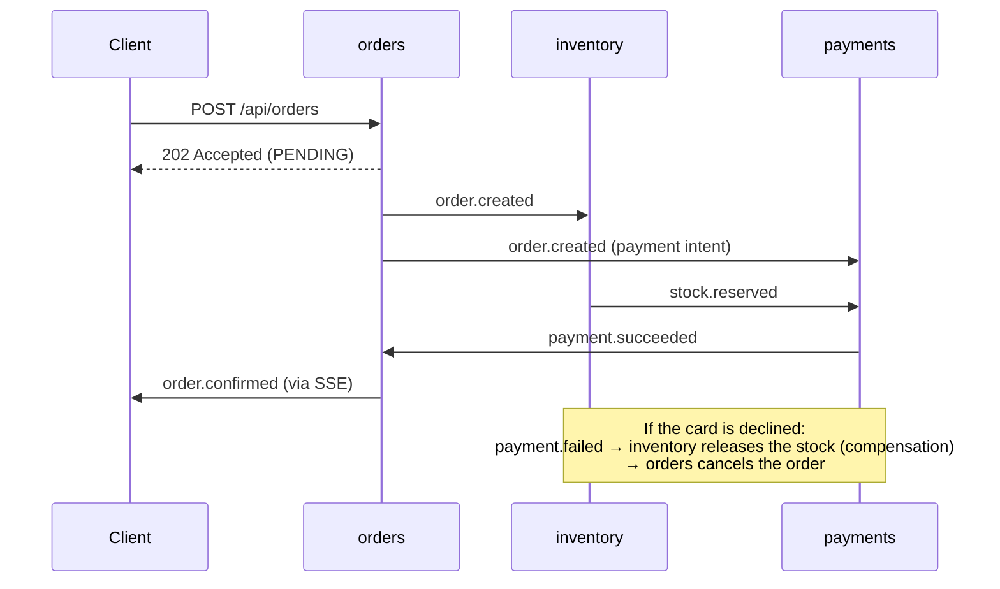

# OrderFlow


Event-driven order processing built as **five polyglot microservices** (TypeScript and
Python) that coordinate through **Redis Streams** with a **choreographed saga**, a
**transactional outbox** and **idempotent consumers**, plus a React client (English /
Spanish) that shows every step of the saga live.

**Live demo:** https://orderflow-demo.onrender.com ·
**API docs (all services):** https://orderflow-api-demo.onrender.com/docs

> The demo runs on free hosting. If it has been idle, the first request can take up to a
> minute while the backend wakes up; the page tells you and refreshes by itself.

## Architecture

```mermaid
flowchart LR
    web[React client] -->|HTTP + SSE| gw[API gateway<br/>NestJS]
    gw --> orders[orders<br/>NestJS]
    gw --> inventory[inventory<br/>FastAPI]
    gw --> payments[payments<br/>FastAPI]
    gw --> notif[notifications<br/>Fastify]
    orders -. prices .-> inventory
    orders <==> bus[(Redis Streams<br/>orderflow:events)]
    inventory <==> bus
    payments <==> bus
    notif <== bus
    orders --- odb[(orders DB)]
    inventory --- idb[(inventory DB)]
    payments --- pdb[(payments DB)]
```

| Service | Stack | Owns | Talks through |
| --- | --- | --- | --- |
| [gateway](services/gateway) | NestJS 12 | nothing (stateless) | HTTP proxy to every service |
| [orders](services/orders) | NestJS 12, TypeORM | orders, saga state | events + one sync call for prices |
| [inventory](services/inventory) | FastAPI, SQLAlchemy 2 async | catalogue, stock reservations | events |
| [payments](services/payments) | FastAPI, SQLAlchemy 2 async | payment intents | events |
| [notifications](services/notifications) | Fastify 5 | notification feed (Redis) | events → Server-Sent Events |
| [web](web) | React 19, Vite 8, Tailwind 4 | – | gateway only |

Each service has its own database, and no service reads another service's tables.

## The order saga



Things to try in the demo:

1. **Happy path**: add a keyboard to the cart and place the order. The timeline goes
   placed → stock reserved → payment captured → confirmed.
2. **Compensation**: tick *Simulate a declined card*. Stock is reserved, the payment
   fails, and inventory puts the units back.
3. **Out of stock**: order the desk lamp (0 units). Inventory rejects it and the payment is
   never attempted.
4. Open **Live events** in another tab to watch the raw events arrive.

## Patterns implemented

| Pattern | Where |
| --- | --- |
| Choreographed saga with compensation | [contracts](contracts/README.md), each service's handlers |
| Transactional outbox + relay | `outbox.py` (Python), `outbox.service.ts` (orders) |
| Idempotent consumer (processed-event table), retries, dead-letter stream | `consumer.py`, `stream-consumer.service.ts` |
| Consumer groups: each service gets every event once, survives restarts | Redis Streams `XREADGROUP` / `XACK` |
| Database per service | [`deploy/postgres/init.sql`](deploy/postgres/init.sql) |
| API gateway: routing, request ids, rate limiting, circuit breaker per service | [services/gateway](services/gateway) |
| API composition with graceful degradation | `GET /api/orders/{id}/summary` |
| Aggregated health checks | `GET /api/health` |
| Push to the browser | Server-Sent Events through the gateway |
| Versioned event contracts | [contracts/schemas](contracts/schemas) |

## Run it locally

Requirements: Docker.

```bash
docker compose up --build
# web      http://localhost:8080
# gateway  http://localhost:3000/docs
scripts/smoke-test.sh          # places three orders and checks every saga outcome
```

To see resilience in action, stop a service and keep using the app:

```bash
docker compose stop payments   # orders wait in STOCK_RESERVED, the summary reports payments as unavailable
docker compose start payments  # payments catches up from its consumer group and the orders confirm
```

Each service can also run on its own with SQLite and no Docker; see its README.

## Testing and CI

| Suite | Tests |
| --- | --- |
| inventory (pytest, SQLite + fakeredis) | 16 |
| payments (pytest) | 12 |
| orders (Vitest unit + e2e with an in-memory stream) | 23 |
| notifications (Vitest, real SSE connection) | 15 |
| gateway (Vitest, e2e against fake upstream servers) | 19 |
| web (Vitest + Testing Library) | 12 |

GitHub Actions lints and tests every service in parallel, then starts the **whole stack
with Docker Compose** and runs the saga smoke test. It also builds the single-container demo
image and smoke-tests it too.

## Deployment

The public demo uses the [single-container image](deploy/demo) on Render's free plan
(Redis embedded, one SQLite file per service, about 300 MB of RAM). The React client is
a static site. Locally and in CI every service runs in its own container with PostgreSQL.

## Repository layout

```
contracts/        event envelope, catalogue and JSON schemas
services/
  gateway/        NestJS API gateway
  orders/         NestJS orders service
  inventory/      FastAPI inventory service
  payments/       FastAPI payments service
  notifications/  Fastify notifications + SSE
web/              React client (EN/ES)
deploy/           Postgres init script, single-container demo image
scripts/          end-to-end smoke test
```

## License

MIT © Miguel Ángel Altamar Rodríguez
