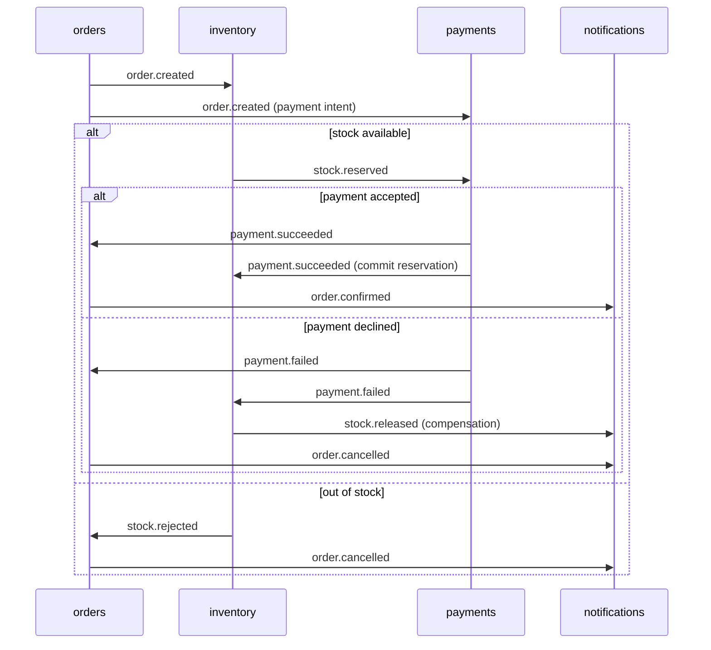

# Event contracts

All services talk to each other asynchronously through a single Redis stream,
`orderflow:events`. Every service reads it through its **own consumer group**, so each
event is delivered once to every interested service and survives restarts (unacknowledged
entries stay in the group's pending list and are retried).

## Envelope

Every stream entry has a single field, `event`, holding this JSON document:

```json
{
  "id": "0b8f7a1e-4f5d-4a53-9c77-2d9c2f1e6a10",
  "type": "order.created",
  "source": "orders",
  "occurredAt": "2026-09-28T02:15:04.120Z",
  "correlationId": "5f1c6f0e-8d3b-4c1a-a5b4-4f6f0d1f7b3e",
  "data": {}
}
```

| Field | Meaning |
| --- | --- |
| `id` | Unique event id (UUID). Consumers store it to stay **idempotent**. |
| `type` | One of the event types below. |
| `source` | Service that produced the event. |
| `occurredAt` | ISO-8601 timestamp (UTC). |
| `correlationId` | The order id. Lets you follow a whole saga across services. |
| `data` | Event payload, described by the JSON schemas in [`schemas/`](schemas). |

Events are written through a **transactional outbox** in each producer: the event row is
stored in the same database transaction as the state change, and a relay publishes it to the
stream afterwards. Delivery is therefore *at least once*, and every consumer deduplicates
by `id`.

## Event catalogue

| Type | Producer | Consumers | Payload |
| --- | --- | --- | --- |
| `order.created` | orders | inventory, payments, notifications | order id, customer, items, total |
| `stock.reserved` | inventory | payments, orders, notifications | order id, reserved items |
| `stock.rejected` | inventory | orders, payments, notifications | order id, reason, sku |
| `payment.succeeded` | payments | orders, inventory, notifications | order id, payment id, amount |
| `payment.failed` | payments | orders, inventory, notifications | order id, payment id, reason |
| `stock.released` | inventory | notifications | order id, released items |
| `order.confirmed` | orders | notifications | order id, total |
| `order.cancelled` | orders | notifications | order id, reason |

## Order saga (choreography)



There is no central orchestrator: each service reacts to the events it cares about and
publishes the outcome. Compensation (releasing reserved stock) is triggered by
`payment.failed`.
