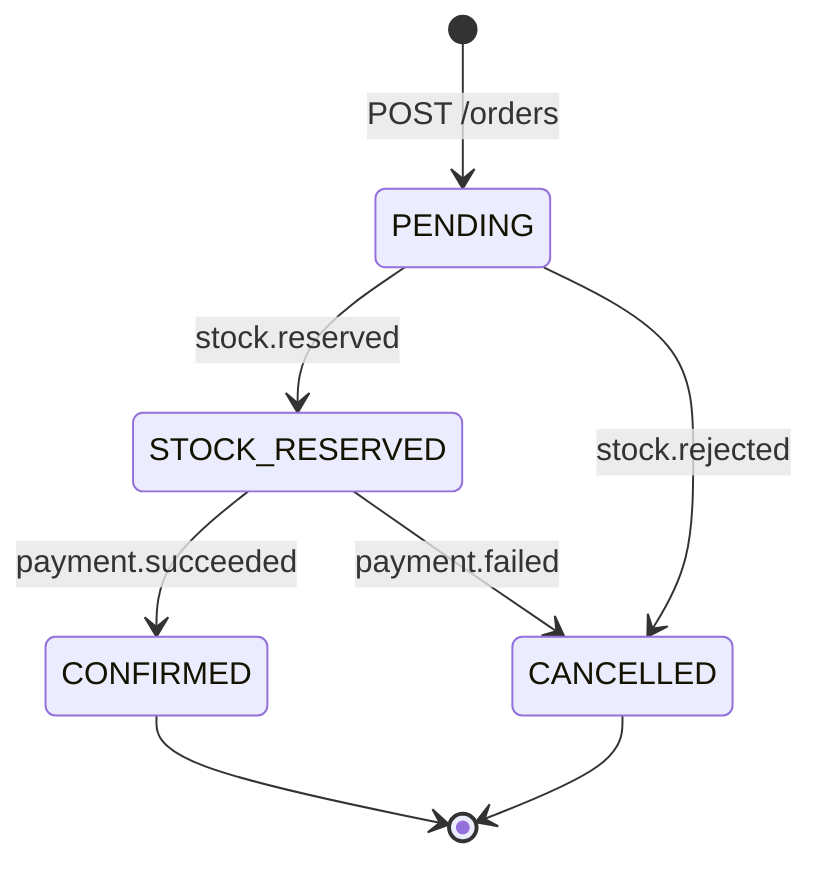

# Orders service

NestJS service that owns the order lifecycle. It accepts orders synchronously
(`202 Accepted`, status `PENDING`) and lets the saga finish them asynchronously.

| | |
| --- | --- |
| Stack | Node.js 22, NestJS 12, TypeORM, ioredis |
| Database | PostgreSQL or SQLite (`better-sqlite3`) |
| Sync dependency | Inventory service (`GET /products?skus=`) for current prices, with timeout and retries |
| Consumes | `stock.reserved`, `stock.rejected`, `payment.succeeded`, `payment.failed` |
| Produces | `order.created`, `order.confirmed`, `order.cancelled` |

## State machine



Terminal states never change, so late or duplicated events are harmless. Every transition
is stored in `order_status_changes` and returned as the order's `history`.

## Endpoints

| Method | Path | Description |
| --- | --- | --- |
| POST | `/orders` | Place an order (`customerEmail`, `items[]`, optional `simulatePaymentFailure`) |
| GET | `/orders?status=&customerEmail=&limit=` | Latest orders |
| GET | `/orders/{id}` | Order with items and saga history |
| GET | `/health` | Database and Redis checks |

Swagger UI at `/docs`, OpenAPI JSON at `/openapi.json`.

## Design notes

- **Transactional outbox** (`src/messaging/outbox.service.ts`): the order row and its
  `order.created` event are committed together; a relay publishes pending rows to Redis.
- **Idempotent consumer** (`src/messaging/stream-consumer.service.ts`): consumer group
  `orders`, `processed_events` table, retries and a dead-letter stream.
- **`TransactionRunner`**: queues transactions on SQLite, which only has one connection.
- `StreamsClient` is an abstract class, so the e2e tests run against an in-memory stream
  implementation without Redis.

## Run locally

```bash
npm install
cp .env.example .env
npm run start:dev
npm test && npm run test:e2e     # unit + 18 e2e tests on SQLite in memory
```
